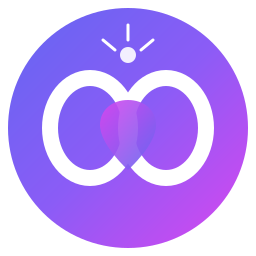

# SoulChain

<div align="center">



**Your Memories. Forever.**

AI-Powered Digital Legacy Platform built on 0G Network

[](https://opensource.org/licenses/MIT)
[](https://0g.ai)
[](https://reactjs.org/)
[](https://vitejs.dev/)

[Demo](#demo) • [Features](#features) • [Installation](#installation) • [Usage](#usage) • [Architecture](#architecture) • [Contributing](#contributing)

</div>

---

## Overview

SoulChain is a revolutionary platform that allows you to store your most precious memories permanently on the blockchain. Built for the **0G Arena Zero Cup 26 hackathon**, it combines:

- **Permanent Storage**: Memories stored on 0G's decentralized storage network
- **Military-Grade Encryption**: 256-bit AES client-side encryption
- **AI Companion**: Real-time knowledge assistant with web access
- **Digital Legacy**: Automatic inheritance to designated beneficiaries
- **NFT Integration**: Mint memories as tradeable assets

## Demo

**Live Demo**: [Coming Soon]

**Video Walkthrough**: [Coming Soon]

## Features

### Core Features

| Feature | Description |
|---------|-------------|
| **Memory Vault** | Store encrypted memories permanently on 0G Network |
| **AI Companion (Nova)** | Intelligent assistant with real-time web access (crypto prices, Wikipedia, memory search) |
| **Smart Contracts** | On-chain verification and memory activation |

### Advanced Features

| Feature | Description |
|---------|-------------|
| **Time Capsule** | Schedule memories to unlock at future dates (birthdays, anniversaries) |
| **Legacy Beneficiary** | Designate who inherits your memories after inactivity |
| **Memory NFTs** | Mint memories as tradeable NFTs with customizable visibility |
| **Multi-Media** | Support for images, audio, and video uploads |
| **Collections** | Organize memories into themed albums |

## Tech Stack

| Category | Technologies |
|----------|--------------|
| **Frontend** | React 18, Vite, React Router |
| **Styling** | CSS Modules, Tailwind CSS |
| **Storage** | 0G Network (Decentralized) |
| **Encryption** | Web Crypto API (AES-256-GCM) |
| **AI** | Custom AI with CoinGecko & Wikipedia APIs |
| **Testing** | Vitest, React Testing Library |
| **Build** | Vite, ESBuild |

## Installation

### Prerequisites

- Node.js >= 18.0.0
- npm >= 9.0.0
- Git

### Quick Start

```bash
# Clone the repository
git clone https://github.com/YOUR_USERNAME/soulchain.git
cd soulchain

# Install dependencies
npm install

# Start development server
npm run dev
```

The app will be available at `http://localhost:5173`

### Production Build

```bash
# Create production build
npm run build

# Preview production build
npm run preview
```

## Usage

### Storing a Memory

1. Navigate to **Memory Vault**
2. Write your memory in the textarea
3. Add meaningful tags
4. Click **"Encrypt & Store to 0G"**
5. Your memory is now stored with a unique hash as proof

### Using Nova AI Companion

```
User: "What is SoulChain?"
Nova: [Comprehensive response about SoulChain]

User: "What's the Bitcoin price?"
Nova: "BTC is currently $67,432 (via CoinGecko)"

User: "Show my happy memories"
Nova: [Lists memories tagged with 'happy']
```

### Creating a Time Capsule

1. Go to **Time Capsule**
2. Write your message for the future
3. Select unlock date (or use presets: Birthday, Anniversary)
4. Create capsule - it remains locked until the unlock date

### Setting Up Legacy Beneficiary

1. Navigate to **Legacy System**
2. Add beneficiary name and wallet address
3. Select relationship type
4. Set percentage allocation
5. If inactive for threshold days, beneficiaries receive your memories

## Architecture

```
┌─────────────────────────────────────────────────────────────┐
│                        SoulChain                             │
├─────────────────────────────────────────────────────────────┤
│  Frontend (React + Vite)                                    │
│  ┌─────────────┐ ┌─────────────┐ ┌─────────────────────┐  │
│  │ Memory Vault│ │ Nova AI     │ │ Smart Contracts      │  │
│  └─────────────┘ └─────────────┘ └─────────────────────┘  │
├─────────────────────────────────────────────────────────────┤
│  Encryption Layer (Web Crypto API - AES-256-GCM)          │
├─────────────────────────────────────────────────────────────┤
│  Storage Layer (0G Network)                                 │
│  ┌─────────────────────────────────────────────────────┐   │
│  │ Decentralized File Storage (Permanent)              │   │
│  └─────────────────────────────────────────────────────┘   │
└─────────────────────────────────────────────────────────────┘
```

### Key Components

| Component | Location | Purpose |
|-----------|----------|---------|
| `App.jsx` | `src/` | Main app with routing |
| `MemoryUpload.jsx` | `src/components/` | Memory storage interface |
| `CompanionChat.jsx` | `src/components/` | Nova AI chat |
| `TimeCapsule.jsx` | `src/components/` | Time capsule feature |
| `LegacyBeneficiary.jsx` | `src/components/` | Legacy planning |
| `MemoryNFT.jsx` | `src/components/` | NFT minting |
| `Effects.jsx` | `src/components/` | Visual effects |

## Testing

### Run Tests

```bash
# All tests
npm run test

# Specific test types
npm run test:smoke
npm run test:unit
npm run test:integration
npm run test:functional
npm run test:e2e

# Coverage report
npm run test:coverage
```

### Test Results

- **82 automated tests** passing
- **Manual test procedures** documented in `src/test/ManualTesting.md`
- **Test report** in `src/test/TestReport.md`

## Project Structure

```
soulchain/
├── public/                 # Static assets
│   ├── video.mp4          # Background video
│   └── Presentation.html  # Slide deck
├── src/
│   ├── components/        # React components
│   │   ├── contracts/     # Smart contract interaction
│   │   ├── MemoryUpload.jsx
│   │   ├── CompanionChat.jsx
│   │   ├── TimeCapsule.jsx
│   │   ├── LegacyBeneficiary.jsx
│   │   ├── MemoryNFT.jsx
│   │   ├── MemoryAssistant.jsx
│   │   ├── MediaUpload.jsx
│   │   ├── MemoryCollections.jsx
│   │   └── Effects.jsx
│   ├── test/              # Test files
│   ├── App.jsx            # Main application
│   ├── App.css            # Styles
│   └── main.jsx           # Entry point
├── package.json
├── vite.config.js
├── vitest.config.js
└── README.md
```

## Deployment

### Deploy to Vercel

```bash
# Install Vercel CLI
npm i -g vercel

# Deploy
vercel
```

### Deploy to Netlify

```bash
# Build
npm run build

# Deploy dist/ folder to Netlify
```

### Deploy to GitHub Pages

```bash
# Add to package.json scripts:
"deploy:gh": "npm run build && gh-pages -d dist"

# Run deploy
npm run deploy:gh
```

## Demo Preparation

For hackathon presentation, see:

- **Demo Script**: `src/DemoScript.md`
- **Video Script**: `src/VideoScript.md`
- **Slide Outline**: `src/PresentationOutline.md`
- **Presentation**: `public/Presentation.html`

## Environment Variables

Create a `.env` file (optional):

```env
VITE_0G_NETWORK=testnet
VITE_COINGECKO_API_KEY=your_key (optional)
```

## Contributing

Contributions are welcome! Please read our [Contributing Guide](CONTRIBUTING.md) for details.

### Development Workflow

```bash
# 1. Fork and clone
git clone https://github.com/YOUR_USERNAME/soulchain.git

# 2. Create feature branch
git checkout -b feature/amazing-feature

# 3. Make changes and test
npm run test

# 4. Commit changes
git commit -m 'Add amazing feature'

# 5. Push and create PR
git push origin feature/amazing-feature
```

## Roadmap

- [ ] Real 0G SDK integration
- [ ] Mobile app (iOS/Android)
- [ ] Collaborative memories
- [ ] Voice interface for Nova AI
- [ ] Memory sentiment analysis
- [ ] Enterprise plans
- [ ] White-label solutions

## Acknowledgments

- **0G Labs** for the decentralized storage infrastructure
- **0G Arena** for hosting the hackathon
- Open source community for libraries and tools

## License

This project is licensed under the MIT License - see the [LICENSE](LICENSE) file for details.

## Team

**SoulChain Team**

- Built for 0G Arena Zero Cup 26
- Contact: team@soulchain.io

---

<div align="center">

**Your memories deserve better than being deleted. They deserve forever.**

[Get Started](#installation) • [Documentation](#usage) • [Report Bug](https://github.com/YOUR_USERNAME/soulchain/issues) • [Request Feature](https://github.com/YOUR_USERNAME/soulchain/issues)

Made with ❤️ for 0G Arena Zero Cup 26

</div>
# Soul_Chain
